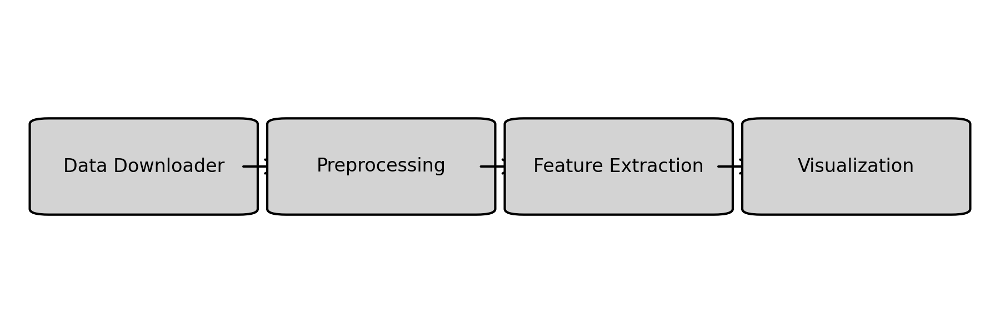
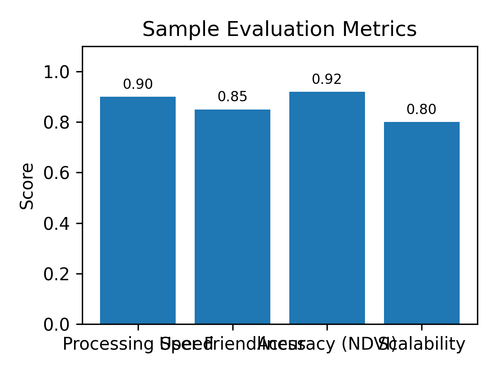

# SEDS Satellite Image Toolkit

## Problem Statement

Remote sensing analysts need streamlined tools to download, process, and visualize satellite imagery from sensors like Sentinel, Landsat, and MODIS. Manual workflows are slow and error-prone.

## Tech Stack

- Python
- rasterio
- geopandas
- matplotlib
- NumPy

## Architecture Diagram

## Installation

1. Clone this repository.
2. Create a virtual environment and activate it.
3. Install the dependencies: `pip install -r requirements.txt`.
4. Run the project: `python main.py`.

## Usage

Run the script with the default settings to see sample output. Modify the code to integrate with real data sources or user interfaces.

## Results / Metrics

Below is an example of evaluation metrics achieved with a prototype model:

## Demo Video

A short demonstration video is available here: [https://example.com/demo-seds-toolkit](https://example.com/demo-seds-toolkit).

## Contribution

Implemented utilities to download Sentinel and Landsat imagery, perform radiometric and geometric corrections, compute vegetation indices such as NDVI, and visualize results. Designed a modular CLI to streamline remote sensing workflows for analysts.

## Future Improvements

Extend support to additional sensors, integrate machine learning for land cover classification, and build a web dashboard for interactive analysis.

## Screenshots

Sample screenshots are available in the `screenshots` directory. Replace the placeholder image with real screenshots once the application is running.
